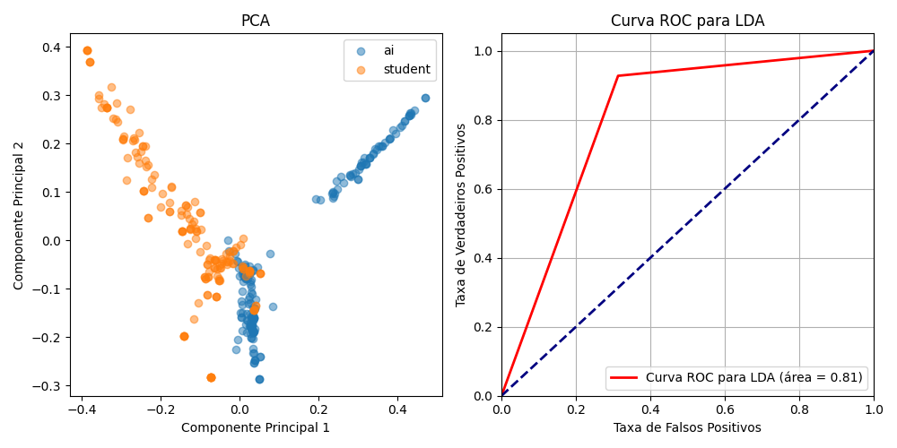
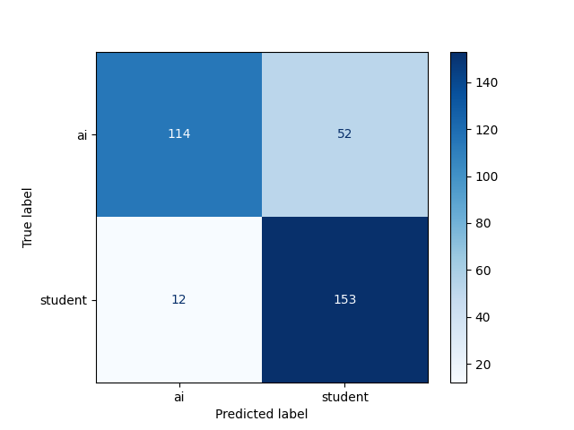
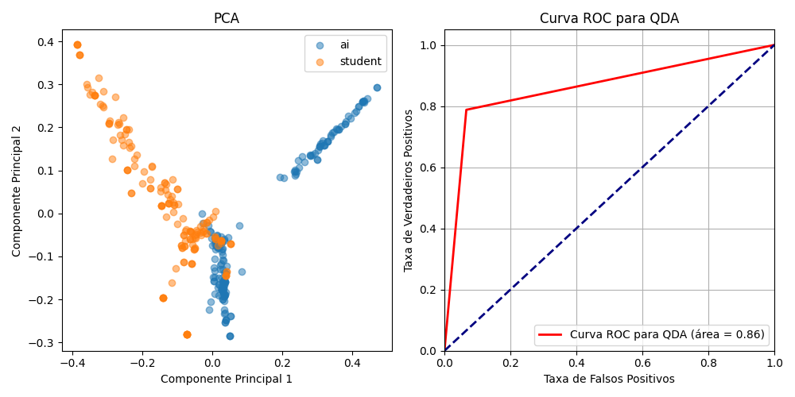
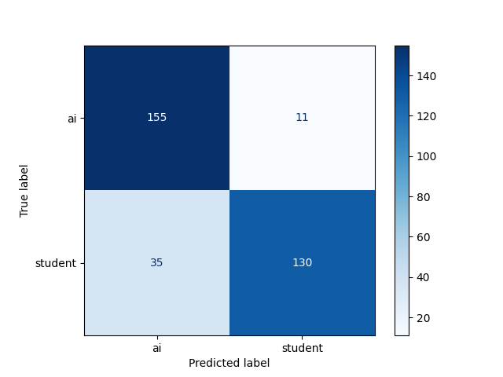
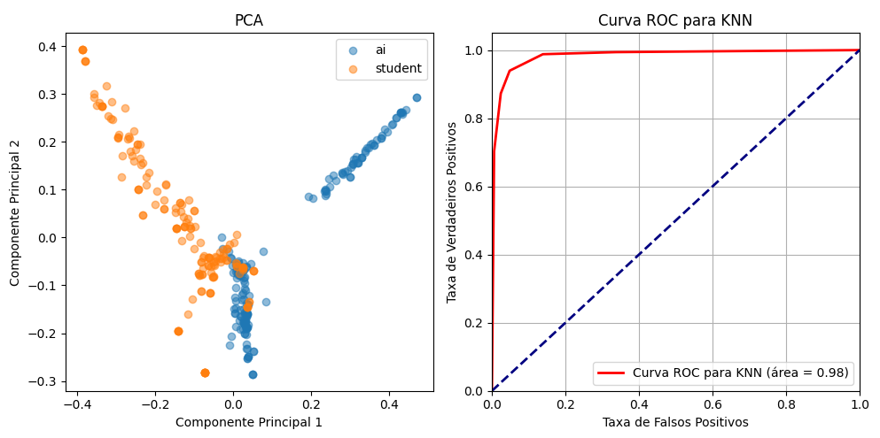
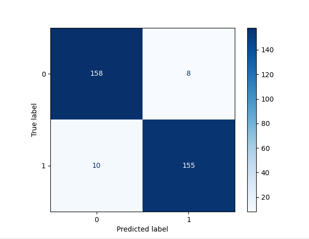
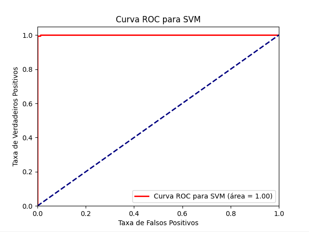
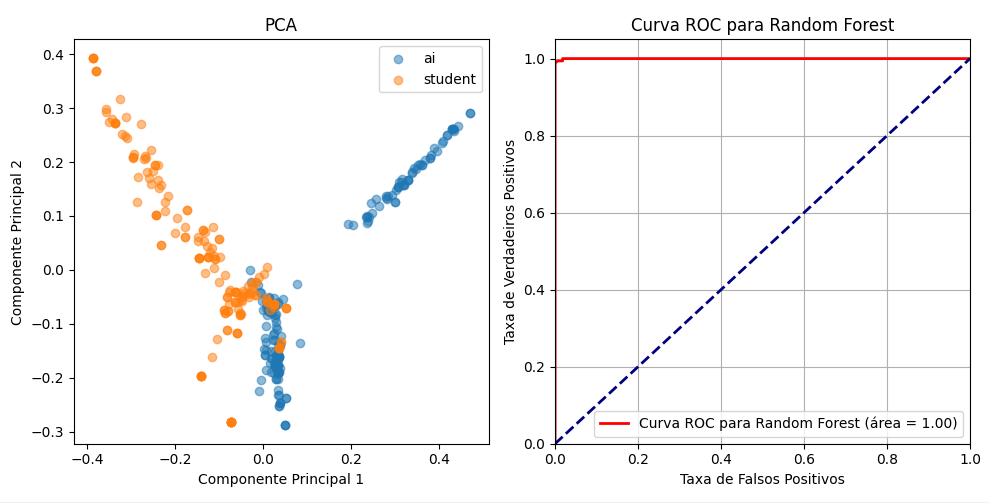
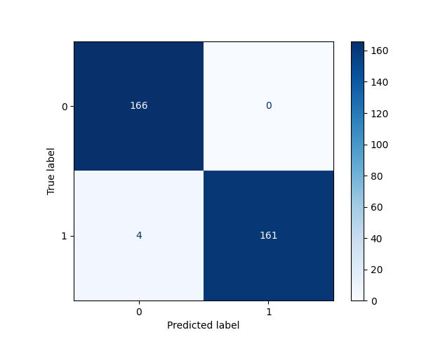

# Classificação Supervisionada de Textos Gerados por IA vs Estudantes

Projeto desenvolvido pelos estudantes Emanuel de Oliveira Barbosa (matrícula 211010403) e Pedro Arthur de Moura Neves (matrícula 211055352), para a disciplina CIC0135 - Introdução a Inteligência Artificial.

Este projeto visa avaliar algoritmos de classificação supervisionada aplicados a textos gerados por IA e estudantes. A base de dados utilizada pode ser encontrada em [Kaggle](https://www.kaggle.com/datasets/prajwaldongre/llm-detect-ai-generated-vs-student-generated-text), no arquivo `LLM.csv`. Este conjunto de dados consiste em pequenos textos em inglês, escritos por um programa de IA ou por um estudante.

## Instalação de Dependências

Para rodar o projeto, é necessário instalar as dependências listadas no arquivo `requirements.txt`. Execute o seguinte comando no terminal:

```bash
pip install -r requirements.txt
```

## Algoritmos Utilizados

Foram desenvolvidos cinco classificadores supervisionados, que visam maximizar a separabilidade entre as classes. 
A divisão dos dados em conjuntos de treinamento (70%) e teste (30%), o treinamento dos modelos, a predição nos dados e as métricas de avaliação foram suportadas pela biblioteca scikit-learn ([scikit-learn](https://scikit-learn.org/stable/index.html)).

Antes de prosseguir, é importante definir alguns conceitos chave:

- **Área sob a curva ROC (AUC)**: Métrica que quantifica a capacidade de um classificador de distinguir entre classes.
- **Matriz de Confusão**: Ferramenta que permite visualizar o desempenho de um modelo de classificação.
- **Acurácia**: Proporção de previsões corretas feitas pelo modelo em relação a todas as previsões.
- **Precisão**: Proporção de verdadeiros positivos entre todos os casos classificados como positivos.
- **Recall (Sensibilidade)**: Proporção de verdadeiros positivos entre todos os casos reais positivos.
- **F1-Score**: Média harmônica da precisão e do recall.

## Resultados Obtidos

### LDA (Linear Discriminant Analysis)

Para executar o algoritmo LDA, utilize o comando:

```bash
python LDA.py
```

O LDA realiza uma análise discriminante linear, buscando reduzir a dimensionalidade para obter um bom classificador com o mínimo de dimensões possíveis. Utiliza o princípio da máxima verossimilhança como critério de maximização.




#### Resultados:

- **Curva ROC**: Área de 0.81
- **Matriz de Confusão**:
  - Verdadeiros Positivos: 153
  - Verdadeiros Negativos: 114
  - Falsos Positivos: 52
  - Falsos Negativos: 12
- **Métricas**:
  - Acurácia: 0.807
  - Precisão: 0.90 (classe 0), 0.75 (classe 1)
  - Recall: 0.69 (classe 0), 0.93 (classe 1)
  - F1-Score: 0.78 (classe 0), 0.83 (classe 1)


### QDA (Quadratic Discriminant Analysis)

Para executar o algoritmo QDA, utilize o comando:

```bash
python QDA.py
```

O QDA é similar ao LDA, exceto que estima variâncias e covariâncias separadas para cada classe.

#### Resultados:




- **Curva ROC**: Área de 0.86
- **Matriz de Confusão**:
  - Verdadeiros Positivos: 130
  - Verdadeiros Negativos: 155
  - Falsos Positivos: 11
  - Falsos Negativos: 35
- **Métricas**:
  - Acurácia: 0.861
  - Precisão: 0.82 (classe 0), 0.92 (classe 1)
  - Recall: 0.93 (classe 0), 0.79 (classe 1)
  - F1-Score: 0.87 (classe 0), 0.85 (classe 1)

### K-NN (K-Nearest Neighbors)

Para executar o algoritmo K-NN, utilize o comando:

```bash
python KNN.py
```

O K-NN não constrói um modelo explícito; ao invés disso, classifica novos exemplos com base nos exemplos armazenados, utilizando os vizinhos mais próximos.

#### Resultados:




- **Curva ROC**: Área de 0.98
- **Matriz de Confusão**:
  - Verdadeiros Positivos: 155
  - Verdadeiros Negativos: 158
  - Falsos Positivos: 8
  - Falsos Negativos: 10
- **Métricas**:
  - Acurácia: 0.949
  - Precisão: 0.95 (ambas as classes)
  - Recall: 0.95 (ambas as classes)
  - F1-Score: 0.95 (ambas as classes)

### SVM (Support Vector Machine)

Para executar o algoritmo SVM, utilize o comando:

```bash
python SVM.py
```

O SVM maximiza o tamanho da margem entre as classes, utilizando um hiperplano que separa os exemplos de cada classe. É um algoritmo de otimização.

#### Resultados:




- **Curva ROC**: Área de 1
- **Matriz de Confusão**:
  - Verdadeiros Positivos: 161
  - Verdadeiros Negativos: 166
  - Falsos Positivos: 0
  - Falsos Negativos: 4
- **Métricas**:
  - Acurácia: 0.988
  - Precisão: 0.98 (classe 0), 1.00 (classe 1)
  - Recall: 1.00 (classe 0), 0.98 (classe 1)
  - F1-Score: 0.99 (classe 0), 0.99 (classe 1)

### Random Forest

Para executar o algoritmo Random Forest, utilize o comando:

```bash
python RandomForest.py
```

O Random Forest é um método que opera por meio da construção de múltiplas árvores de decisão durante o treinamento e produz a saída pela classe que é a moda das classes (classificação) ou média predita (regressão) dos indivíduos árvores.

#### Resultados:




- **Curva ROC**: Área de 1
- **Matriz de Confusão**:
  - Verdadeiros Positivos: 161
  - Verdadeiros Negativos: 166
  - Falsos Positivos: 0
  - Falsos Negativos: 4
- **Métricas**:
  - Acurácia: 0.988
  - Precisão: 0.98 (classe 0), 1.00 (classe 1)
  - Recall: 1.00 (classe 0), 0.98 (classe 1)
  - F1-Score: 0.99 (classe 0), 0.99 (classe 1)

## Análise Comparativa

1. **SVM e Random Forest**: Ambos apresentam excelentes desempenhos, com AUC de 1 e acurácia de 0.988, sendo igualmente precisos na tarefa.
2. **K-NN**: Apresenta uma AUC de 0.98 e acurácia de 0.949, sendo um classificador robusto, mas ligeiramente inferior ao SVM e Random Forest.
3. **QDA**: Com AUC de 0.86 e acurácia de 0.861, é menos eficaz que os três métodos anteriores, mas ainda assim apresenta bom desempenho.
4. **LDA**: Tem a menor AUC (0.81) e acurácia (0.807) entre os classificadores testados.

## Conclusão

Considerando que o algoritmo Random Forest consiste na execução de múltiplas árvores de decisão, é coerente que, devido às inúmeras tentativas de classificação com os dados disponíveis, este algoritmo possua um desempenho superior aos demais, alcançando um valor de AUC de 1 (100%). Assim, ele é capaz de distinguir com clareza, de maneira simples, eficaz e rápida, textos escritos por estudantes de textos escritos por IA.

